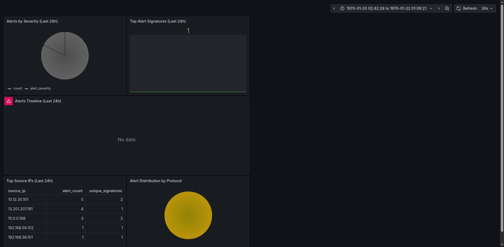
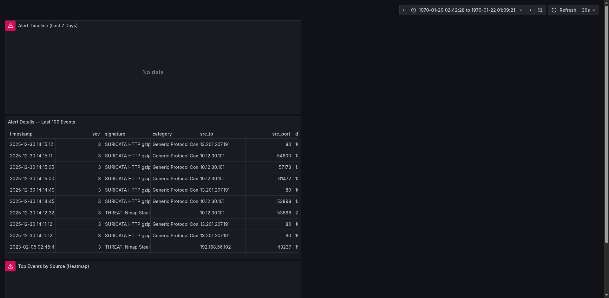
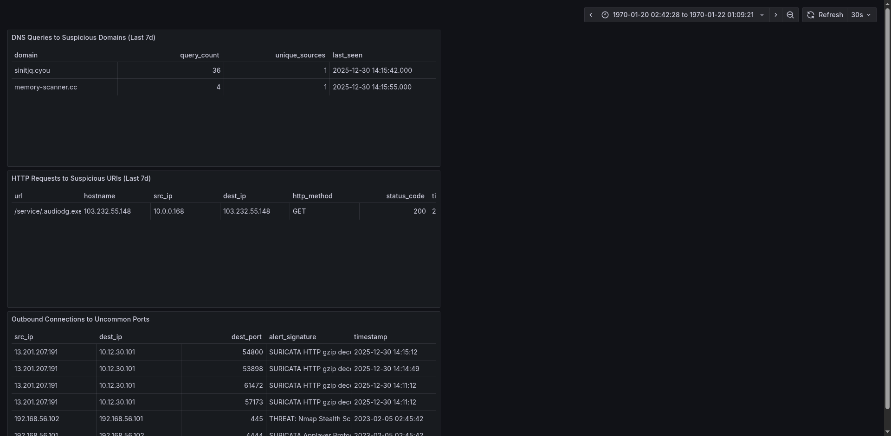

# Detection Logic — Simulated Attacks

## 1. Port Scan Detection

**What happened:**
Nmap was launched from a remote machine targeting ports 22, 80, 443, 8080, and 3306 on the monitored host. Suricata's Emerging Threats ruleset detected this as `ET SCAN Nmap` or similar scan signature.

**Why it matters:**
Port scanning is the first step of nearly every attack. Attackers enumerate open ports to find attack surface. Detecting scans early gives defenders a chance to block the source before exploitation begins.

**In the dashboard:**
You'll see a spike in `alert_severity=3` (low) alerts from a single source IP, with multiple unique `dest_port` values. The source IP appears in the "Top Source IPs" panel.

---

## 2. SSH Brute Force Attempt

**What happened:**
Hydra attempted to log in as `root` via SSH with 10 common passwords. Custom rule `sid:1000001` triggered after the 5th failed attempt from the same source within 60 seconds.

**Why it matters:**
SSH brute force is one of the most common internet-wide attacks. Even a low-success-rate attack can succeed if ran long enough. Automated detection prevents credential compromise.

**In the dashboard:**
The source IP appears in the "Top Source IPs" panel with multiple SSH-related alerts clustered within minutes. The custom threshold rule (`sid:1000001`) fires after 5 failures.

---

## 3. ICMP Probe

**What happened:**
A ping sweep was run against the monitored host. Custom rule `sid:1000003` detected ICMP packets larger than 1400 bytes or an abnormal volume from one source.

**Why it matters:**
Attackers use ICMP to map networks and identify live hosts. Combined with other reconnaissance signals, this helps build attacker intent.

**In the dashboard:**
ICMP-related alerts appear in the timeline. The `proto` pie chart shows a higher proportion of ICMP traffic than normal.

---

## 4. C2 Beacon / Malware Download

**What happened:**
A simulated malware download (`update.exe`) was requested from an external IP via HTTP. Custom rule `sid:1000007` detected the `.exe` download. DNS queries to suspicious domains (`.xyz`) were also generated, triggering `sid:1000004`.

**Why it matters:**
C2 beacons and malware downloads represent post-compromise activity. Detecting these means catching the breach during or after initial access — still early enough to contain damage.

**In the dashboard:**
The Threat Intelligence view shows the suspicious domain and HTTP request. The incident timeline shows the correlation between DNS query and HTTP download.

---

## Dashboard Screenshots

The following screenshots show live data in Grafana after running the attack simulations:

> SOC Alerts Overview dashboard showing severity breakdown, top signatures, alert timeline, and top source IPs.

> Incident timeline showing alert heatmap, event drill-down, and source IP clustering over 7 days.

> Threat Intelligence dashboard showing suspicious DNS queries, malware downloads, and uncommon outbound connections.
